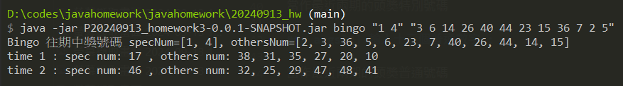

# 20240913作業

## 一、日期排序

args
----
### args[0] class名稱 : 

固定為 sort

### args[1] 根據輸入的ymd順序排序，預設為 yyy :

y, m, d 可隨意變換位置，最多三個，超過的部分會被忽視，少於三個時，將自動補上 y，比如只輸入md，則會被當md(y)，只輸入d，結果就會是d(yy)

### args[2] 降序 true | 升序 false : 

預設為降序，輸入true以外的文字都將被當false


使用方式
----
日期資料為固定，只能做排序的動作


使用預設值
``` terminal
java -jar P20240913_homework3-0.0.1-SNAPSHOT.jar sort 
```

自訂排序
``` terminal
java -jar P20240913_homework3-0.0.1-SNAPSHOT.jar sort myd false 
```


## 二、大樂透
args
----
### args[0] class名稱 : 

固定為 bingo

### args[1] 輸入至少一個特別數字 :
多個數字請用 "3 4 5" 的方式傳送，範圍為1~49，超過範圍的數字將被忽略， args[1] 會當作最近的頭獎特別號碼，並排除掉

### args[2] 輸入至少一個普通數字 : 

數字規則同上，當作最近的頭獎普通號碼，並排除掉


使用方式
----

數字可輸入隨意數量(範例模擬前兩期大樂透頭彩號碼，共14碼)，每次固定生成兩張不與前兩期頭獎號碼相同的彩券
``` terminal
java -jar P20240913_homework3-0.0.1-SNAPSHOT.jar bingo "1 4" "3 6 14 26 40 44 23 15 36 7 2 5"
```
