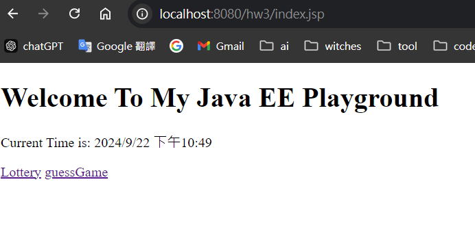
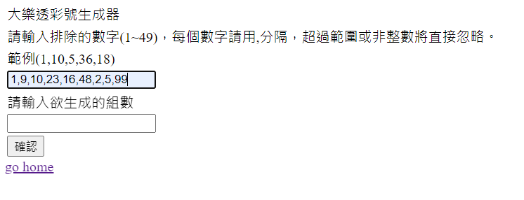
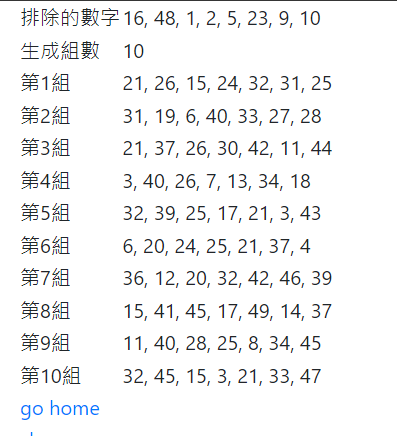
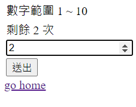
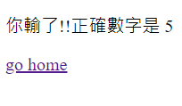

# 20240922 回家作業

## Lottery

1. 直接點擊Lottery即可進入畫面



2. 輸入要排除的數字，並用,分隔，超出規定範圍不算入
```java
1,9,11,23,16,48,0,99 
// 0 與 99 將直接被忽略
```



3. 輸入要生成組數數量，點擊確認後，就會自動生成，每組7個號碼



## GuessGame

1. 直接點擊guessGame進入畫面，範圍固定1~10，可猜次數為三，次數到了後將跳至失敗畫面，輸入不是在範圍內的數字不扣次數，但重複猜相同的數字會扣次數




